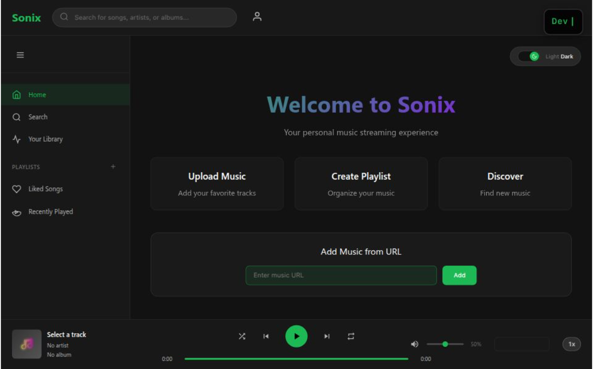

# 🎵 Sonix

> **A sleek, modern web-based music streaming platform built with TypeScript and Vite**

[](https://my-sonix.vercel.app/)
[](https://www.typescriptlang.org/)
[](https://vitejs.dev/)
[](https://vercel.com/)

---

## ✨ Features

### 🎧 **Core Music Player**
- **Smooth Audio Playback** - High-quality streaming with seamless controls
- **Progress Control** - Click-to-seek with smooth progress bar
- **Volume Control** - Adjustable volume with visual feedback
- **Playback Speed** - Variable speed control (0.5x to 2x)

### 🎮 **Advanced Controls**
- **Shuffle Mode** - Randomize your listening experience
- **Repeat Modes** - Loop single track or entire playlist
- **Keyboard Shortcuts** - Space to play/pause, arrow keys for navigation
- **URL Upload** - Add music from direct URLs

### 🎨 **Modern UI/UX**
- **Dark/Light Theme** - Toggle between elegant themes
- **Responsive Design** - Works perfectly on desktop and mobile
- **Smooth Animations** - Buttery smooth transitions and effects
- **TypeWriter Effect** - Dynamic developer signature in top-right
- **Glass Morphism** - Modern blur effects and transparency

### 📚 **Library Management**
- **Your Library** - Organize your favorite tracks
- **Playlists** - Create and manage custom playlists
- **Recently Played** - Quick access to recent tracks
- **Liked Songs** - Heart your favorite music

### 🔍 **Discovery**
- **Search Function** - Find songs, artists, and albums
- **Upload Music** - Add your own tracks to the platform
- **Music Discovery** - Explore new content

---

## 🚀 Live Demo

**🌐 [Try Sonix Now](https://my-sonix.vercel.app/)**

---

## 🛠️ Tech Stack

| Technology | Purpose |
|------------|---------|
| **TypeScript** | Type-safe development |
| **Vite** | Lightning-fast build tool |
| **Vanilla CSS** | Custom styling with CSS variables |
| **Web Audio API** | Advanced audio processing |
| **Local Storage** | Persistent user preferences |
| **Vercel** | Deployment and hosting |

---

## 🎯 Key Highlights

### 🎵 **Audio Engine**
- Built with native Web Audio API for optimal performance
- Support for multiple audio formats (MP3, WAV, OGG)
- Real-time audio visualization (coming soon)

### 🎨 **Design Philosophy**
- **Spotify-inspired** layout with modern improvements
- **Accessible** design following WCAG guidelines
- **Performance-first** with smooth 60fps animations
- **Mobile-responsive** for all device sizes

### ⚡ **Performance**
- **Lightning fast** loading with Vite optimization
- **Lazy loading** for better initial page load
- **Efficient bundling** with tree shaking
- **CDN delivery** via Vercel Edge Network

---

## 📱 Screenshots
### 🖼️ **App Preview**


*Experience the sleek, modern interface of Sonix - your new favorite music streaming platform*


---

## 🚀 Getting Started

### Prerequisites
- Node.js 18+ 
- npm or yarn

### Installation

```bash
# Clone the repository
git clone https://github.com/dukebismaya/Sonix.git

# Navigate to project directory
cd Sonix

# Install dependencies
npm install

# Start development server
npm run dev

# Build for production
npm run build
```

### Environment Setup
```bash
# Development
npm run dev     # Starts dev server at http://localhost:5173

# Production
npm run build   # Builds optimized production bundle
npm run preview # Preview production build locally
```

---

## 🎵 Usage

### **Basic Playback**
1. **Upload Music** - Click "Upload Music" or use "Add Music from URL"
2. **Browse Library** - Navigate through your uploaded tracks
3. **Play Controls** - Use the bottom player for playback control

### **Advanced Features**
- **Keyboard Shortcuts**: `Space` (play/pause), `←/→` (seek), `↑/↓` (volume)
- **Playlists**: Create custom playlists from "Create Playlist"
- **Themes**: Toggle dark/light mode with the theme switcher
- **Search**: Find specific tracks using the search bar

---

## 🤝 Contributing

Contribution is appreciated! Here's how you can help:

### **Ways to Contribute**
- 🐛 **Bug Reports** - Found an issue? Let us know!
- ✨ **Feature Requests** - Have an idea? Share it!
- 🔧 **Code Contributions** - Submit a pull request
- 📖 **Documentation** - Help improve our docs

### **Development Process**
```bash
# Fork the repository
# Create feature branch
git checkout -b feature/new-feature

# Make changes and commit
git commit -m "Add new feature"

# Push to branch
git push origin feature/new-feature

# Open a Pull Request
```

---

## 🐛 Known Issues & Roadmap

### **Current Limitations**
- File upload limited to direct URLs
- No user authentication yet
- No cloud storage integration

### **Upcoming Features**
- 🎨 Audio visualizations
- 👥 Social features & sharing
- 🎵 Spotify/YouTube Music integration
- 📱 Progressive Web App (PWA)
- 🎤 Lyrics display
- 🎪 Equalizer controls

---

## 📄 License

This project is licensed under the **GNU GENERAL PUBLIC LICENSE** - see the [LICENSE](LICENSE) file for details.

---

## 👨‍💻 Developer

**Developed with ❤️ by [Dev Bismaya](https://github.com/dukebismaya)**

- 🌐 **Live Demo**: [my-sonix.vercel.app](https://my-sonix.vercel.app/)
- 📧 **Email**: [bismayajyotidalei@gmail.com](mailto:bismayajyotidalei@gmail.com)
- 🐙 **GitHub**: [@dukebismaya](https://github.com/dukebismaya)
- 💼 **LinkedIn**: [Bismaya Jyoti Dalei](https://www.linkedin.com/in/bismaya-jyoti-d-74692a328/)

---

## 🙏 Acknowledgments

- **Inspiration**: Spotify's elegant design philosophy
- **Icons**: Heroicons and custom SVG designs
- **Hosting**: Vercel for seamless deployment
- **Community**: All contributors and users

---

<div align="center">

**⭐ Star this project if you found it helpful!**

[](https://github.com/dukebismaya/Sonix/stargazers)
[](https://github.com/dukebismaya/Sonix/network/members)

</div>

---

*Built with TypeScript, Vite, and lots of ☕*